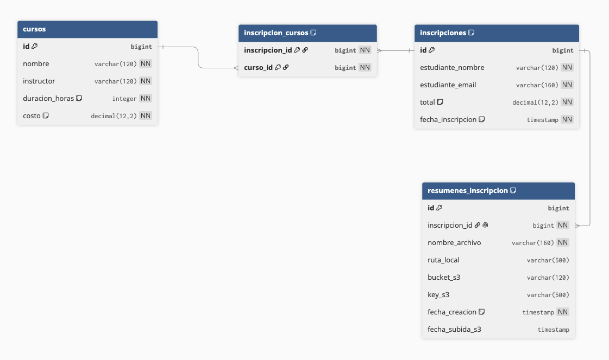

# Curso Inscripciones Service

Microservicio Spring Boot para una plataforma educativa. Usa H2 como base de datos local y expone endpoints para cursos e inscripciones.

## Ejecutar localmente

```bash
mvn spring-boot:run
```

La API queda disponible en `http://localhost:8080`.

La consola H2 queda disponible en `http://localhost:8080/h2-console`.

- JDBC URL: `jdbc:h2:file:./data/inscripciones-db`
- User: `sa`
- Password: dejar vacio

Para usar la integracion con AWS S3, configurar estas variables de entorno antes de iniciar:

```bash
export AWS_REGION=us-east-1
export AWS_S3_RESUMENES_BUCKET=nombre-del-bucket
```

Las credenciales AWS se resuelven con el proveedor por defecto del SDK de AWS: variables de entorno, perfil local, rol de EC2 u otro mecanismo soportado por AWS.

Los resumenes fisicos generados al crear una inscripcion se guardan por defecto en `./resumenes`. La ruta se puede cambiar con:

```bash
export RESUMENES_LOCAL_DIR=./resumenes
```

## Base de datos

El esquema de base de datos se construye desde `src/main/resources/schema.sql` y los datos iniciales desde `src/main/resources/data.sql`. La aplicacion no depende de `ddl-auto=update`, por lo que las tablas y relaciones quedan declaradas de forma explicita y reproducible.

### Tabla `cursos`

| Columna | Tipo | Descripcion |
| --- | --- | --- |
| `id` | `BIGINT` | Identificador primario autoincremental. |
| `nombre` | `VARCHAR(120)` | Nombre del curso. |
| `instructor` | `VARCHAR(120)` | Relator o instructor asignado. |
| `duracion_horas` | `INTEGER` | Duracion del curso. Debe ser mayor a cero. |
| `costo` | `DECIMAL(12,2)` | Valor del curso. Debe ser mayor o igual a cero. |

### Tabla `inscripciones`

| Columna | Tipo | Descripcion |
| --- | --- | --- |
| `id` | `BIGINT` | Identificador primario autoincremental. |
| `estudiante_nombre` | `VARCHAR(120)` | Nombre del estudiante inscrito. |
| `estudiante_email` | `VARCHAR(160)` | Correo del estudiante. |
| `total` | `DECIMAL(12,2)` | Suma de los costos de los cursos inscritos. |
| `fecha_inscripcion` | `TIMESTAMP` | Fecha y hora en que se registra la inscripcion. |

### Tabla `inscripcion_cursos`

Tabla intermedia que resuelve la relacion muchos a muchos entre inscripciones y cursos.

| Columna | Tipo | Descripcion |
| --- | --- | --- |
| `inscripcion_id` | `BIGINT` | Referencia a `inscripciones.id`. |
| `curso_id` | `BIGINT` | Referencia a `cursos.id`. |

### Tabla `resumenes_inscripcion`

Tabla que registra la metadata del archivo fisico y del objeto S3 asociado al resumen de una inscripcion. Cada inscripcion puede tener un resumen vigente.

| Columna | Tipo | Descripcion |
| --- | --- | --- |
| `id` | `BIGINT` | Identificador primario autoincremental. |
| `inscripcion_id` | `BIGINT` | Referencia unica a `inscripciones.id`. |
| `nombre_archivo` | `VARCHAR(160)` | Nombre del archivo de resumen. |
| `ruta_local` | `VARCHAR(500)` | Ruta del archivo fisico generado en el servidor. |
| `bucket_s3` | `VARCHAR(120)` | Bucket donde se sube el resumen. |
| `key_s3` | `VARCHAR(500)` | Key del objeto dentro de S3. |
| `fecha_creacion` | `TIMESTAMP` | Fecha de creacion del registro de resumen. |
| `fecha_subida_s3` | `TIMESTAMP` | Fecha de la ultima subida o reemplazo en S3. |

### Modelo de Datos

El estado actual del modelo de datos es:

Fecha de actualizacion del diagrama: `2026-06-01`



El diagrama representa las tablas declaradas en `src/main/resources/schema.sql`, incluyendo la relacion entre cursos, inscripciones, la tabla intermedia `inscripcion_cursos` y la metadata de resumenes en `resumenes_inscripcion`.

## Endpoints

### Listar cursos

```http
GET /api/cursos
```

### Crear curso

```http
POST /api/cursos
Content-Type: application/json

{
  "nombre": "Arquitectura de Microservicios",
  "instructor": "Daniela Perez",
  "duracionHoras": 20,
  "costo": 89990
}
```

### Crear inscripcion

```http
POST /api/inscripciones
Content-Type: application/json

{
  "estudianteNombre": "Ana Gonzalez",
  "estudianteEmail": "ana.gonzalez@duocuc.cl",
  "cursoIds": [1, 2]
}
```

La respuesta incluye cursos seleccionados, costo por curso, total a pagar y la ruta local del archivo fisico generado. El resumen queda guardado en:

```text
resumenes/inscripciones/id=1/resumen-inscripcion.txt
```

### Listar inscripciones

```http
GET /api/inscripciones
```

### Descargar resumen de inscripcion

Descarga el archivo fisico `.txt` generado al crear la inscripcion. Si el archivo local no existe, se vuelve a generar desde la informacion de la inscripcion.

```http
GET /api/inscripciones/1/resumen
```

### Subir resumen generado a AWS S3

Genera el resumen y lo sube al bucket configurado. El archivo se guarda dentro de una carpeta cuyo nombre corresponde al numero de inscripcion.

Ruta S3 resultante:

```text
nombre-del-bucket/inscripciones/id=1/resumen-inscripcion.txt
```

```http
POST /api/inscripciones/1/resumen/s3
```

### Modificar resumen en AWS S3

Permite reemplazar el archivo del resumen cuando se necesita corregirlo.

```http
PUT /api/inscripciones/1/resumen/s3
Content-Type: multipart/form-data

file=@resumen-corregido.txt
```

### Descargar resumen desde AWS S3

```http
GET /api/inscripciones/1/resumen/s3
```

### Borrar resumen en AWS S3

```http
DELETE /api/inscripciones/1/resumen/s3
```

## Despliegue con GitHub Actions

El workflow `.github/workflows/main.yml` compila el proyecto, ejecuta pruebas, publica la imagen en Docker Hub y despliega el contenedor en EC2 por SSH.

Secrets requeridos en GitHub:

| Secret | Uso |
| --- | --- |
| `DOCKERHUB_USERNAME` | Usuario de Docker Hub para construir el nombre de la imagen y autenticarse. |
| `DOCKERHUB_TOKEN` | Token de Docker Hub para login, push y pull. |
| `EC2_HOST` | Host publico o IP publica de la instancia EC2. |
| `EC2_SSH_KEY` | Llave privada SSH para conectarse a EC2. |
| `USER_SERVER` | Usuario SSH de la instancia EC2. |
| `AWS_ACCESS_KEY_ID` | Access key usada por el contenedor para operar con S3. |
| `AWS_SECRET_ACCESS_KEY` | Secret key usada por el contenedor para operar con S3. |
| `AWS_SESSION_TOKEN` | Token temporal de AWS Academy/Lab, si corresponde. |
| `AWS_S3_RESUMENES_BUCKET` | Bucket donde se guardan los resumenes de inscripcion. |

Durante el despliegue, el contenedor recibe estas variables:

```bash
AWS_REGION=us-east-1
AWS_S3_RESUMENES_BUCKET=${AWS_S3_RESUMENES_BUCKET}
RESUMENES_LOCAL_DIR=/app/resumenes
AWS_ACCESS_KEY_ID=${AWS_ACCESS_KEY_ID}
AWS_SECRET_ACCESS_KEY=${AWS_SECRET_ACCESS_KEY}
AWS_SESSION_TOKEN=${AWS_SESSION_TOKEN}
```

Tambien se montan volumenes persistentes en EC2:

```text
~/curso-inscripciones-data:/app/data
~/curso-inscripciones-resumenes:/app/resumenes
```

## Docker

Construir imagen:

```bash
docker build -t tu-usuario-dockerhub/curso-inscripciones-service:latest .
```

Ejecutar contenedor:

```bash
docker run -p 8080:8080 tu-usuario-dockerhub/curso-inscripciones-service:latest
```

Publicar en Docker Hub:

```bash
docker login
docker push tu-usuario-dockerhub/curso-inscripciones-service:latest
```

## Changelog

### 2026-05-25

- Se implemento la base del microservicio de cursos e inscripciones.
- Se agregaron endpoints para listar y crear cursos.
- Se agregaron endpoints para crear y listar inscripciones.
- Se integro la base de datos H2 para persistir cursos, inscripciones y la relacion entre ambos.
- Se preparo la ejecucion de la aplicacion mediante Docker.
- Se incorporo el workflow inicial de GitHub Actions para construir la imagen, publicarla en Docker Hub y desplegar en AWS EC2.

### 2026-06-01

- Se agrego la funcionalidad de generacion de resumen fisico al crear una inscripcion.
- Se incorporaron endpoints para subir, reemplazar, descargar y eliminar resumenes en AWS S3.
- Se definio la jerarquia S3 `inscripciones/id={id_inscripcion}/resumen-inscripcion.txt`.
- Se agrego la tabla `resumenes_inscripcion` para persistir metadata del archivo local y del objeto S3 asociado a cada inscripcion.
- Se actualizo el workflow de GitHub Actions para desplegar el contenedor con variables AWS y volumenes persistentes.
- Se incorporo Lombok en los modelos para reducir codigo repetitivo y mantener las entidades mas legibles.
- Se agrego el diagrama del modelo de datos como evidencia visual en `docs/images/schema-db.png`.
